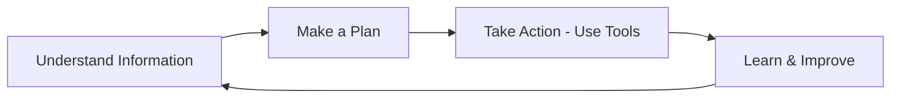
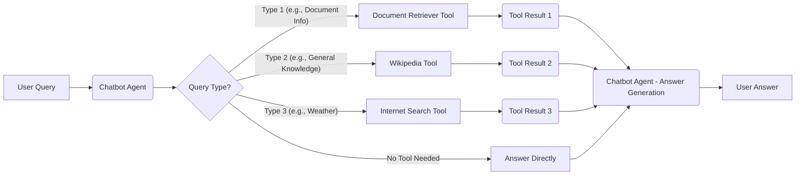

# Welcome to Agentic AI: AI that Acts

You are familiar with AI assistants like Siri or Alexa that respond to your questions. Agentic AI is a step beyond this.

**Agentic AI is designed to take actions, not just react.**

Consider this difference:

- **Typical AI (like Siri):** You ask "What is the weather?" and it replies. It waits for your questions.
- **Agentic AI:** You might say "Plan a beach trip next weekend." Agentic AI would then perform actions for you. It could:
  - **Research** beaches.
  - **Check** flight and hotel availability.
  - **Compare prices.**
  - **Book reservations (with your approval).**

**The core idea is that AI can set goals and act to achieve them independently.**

## The Agentic Chatbot I built

I built an Agentic AI chatbot to demonstrate basic Agentic AI concepts.

`This repository contains the code for that chatbot.`

[CHECK OUT THE AGENTIC CHATBOT HERE.](https://agentic-ai.streamlit.app/)

## How My Chatbot Demonstrates Agentic Behavior

My chatbot acts as a basic agent by:

- **Deciding how to answer:**
  - When you ask a question, the chatbot determines the best way to find the answer.
- **Accessing Information:** It can automatically:
  - Read provided documents.
  - Check Wikipedia.
  - Search the internet.
- **Agentic Action:**
  - The chatbot does not just stop at finding information, but it also performs actions in your behalf.
  - The [chatbot creates issues in Github](https://github.com/kanad1323/agentic-ai-output/issues) based on the interactions it had with you and the instructions you gave.

## Examples of Agentic AI Concepts

You might have heard of Agentic AI in examples like:

- **Claude's "Computer Use":** This lets you ask Claude to perform tasks directly on a computer, like ordering food online. [Youtube Video](https://youtu.be/ODaHJzOyVCQ?t=37)
- **OpenAI's "Operator":** This AI can browse the internet to complete tasks for you, such as booking flights. [Youtube Video](https://youtu.be/CSE77wAdDLg?t=136)

These are examples of AI designed to take actions to assist you.

## Under the hood

This section provides a technical overview of the Agentic AI Chatbot I have built.

### Core Framework: Langchain

The chatbot is built using [Langchain](https://python.langchain.com/docs/introduction/).
Langchain simplifies the process of creating complex AI agent workflows by providing tools and abstractions for:

- **Integrating Language Models:** Connecting to various language models like OpenAI, Google, and Groq.
- **Tool Management:** Defining and using tools to extend the agent's capabilities.
- **Memory Management:** Handling conversation history and agent state.
- **Agent Logic:** Structuring the agent's decision-making process.

Langchain serves as the foundational layer for my chatbot, orchestrating the different components of the chatbot to work together effectively.

### Language Models (LLMs)

Large Language Models (LLMs) models are the "brain" of the chatbot, responsible for:

- **Understanding User Input:** Processing and interpreting your questions.
- **Generating Text:** Crafting responses, performing reasoning, and formulating actions.

You can select from different LLMs in the sidebar, including:

- OpenAI GPT-4o
- Meta Llama-3.1
- Google Gemma-2

### Tools: Extending Agent Capabilities

To go beyond simply answering questions, the chatbot utilizes [tool calling](https://python.langchain.com/docs/concepts/tool_calling/).

Tools provide the agent with access to external information and the ability to perform actions. The chatbot is equipped with the following tools:

- **Document Retriever:** This tool allows the agent to access and search the documents you provide in the "input_files" directory.

  - [Retrieval-Augmented Generation (RAG)](https://python.langchain.com/docs/tutorials/rag/#setup): The agent uses these documents to inform its answers, ensuring responses are grounded in provided information.
  - [Vector Store (FAISS)](https://faiss.ai): For efficient searching of documents, the chatbot uses a FAISS vector store. Documents are converted into numerical vector representations using embeddings.
  - [Embeddings (HuggingFace)](https://huggingface.co/sentence-transformers/all-mpnet-base-v2): HuggingFace embeddings are used to create vector representations of text, enabling semantic similarity search within the document store.

- **General Knowledge Access:** This tool enables the agent to search and retrieve information from **Wikipedia**.

  - [Wikipedia Retriever](https://python.langchain.com/docs/integrations/retrievers/wikipedia/): Provides access to a vast repository of general knowledge for answering a wide range of queries.

- **Internet Search:** This tool allows the agent to perform real-time searches on the **internet** using the Tavily Search API. - [Tavily Tool](https://python.langchain.com/docs/integrations/tools/tavily_search): Enables the agent to access current information and answer questions requiring real-time data.

### Agent Workflow: ReAct Logic

The chatbot operates using a **ReAct** (Reason, Act, Observe) framework. [This framework](https://langchain-ai.github.io/langgraph/reference/prebuilt) defines the agent's decision-making process:

1.  **Reason:** The agent analyzes your question and determines the best course of action to answer it. This may involve deciding which tool to use, or if direct generation is sufficient.
2.  **Act:** Based on its reasoning, the agent takes an action. This could be:
    - Using a tool (Document Retriever, Wikipedia, Internet Search) to gather information.
    - Generating a direct text response if it has enough information.
3.  **Observe:** The agent observes the outcome of its action.
    - If a tool was used, it processes the information retrieved by the tool.
    - If it generated a response, it prepares to present it to the user.

This process is guided by a [Prompt Template](https://python.langchain.com/docs/concepts/prompt_templates/), which provides instructions to the agent on how to use tools, prioritize information sources, and format its responses.

### Memory and Conversation History

To maintain context and have coherent conversations, the chatbot utilizes **memory**.

- **MemorySaver:** The [MemorySaver](https://python.langchain.com/docs/how_to/chatbots_memory/) component is used to store the history of your conversation with the chatbot.
- **Contextual Conversations:** This memory allows the chatbot to remember previous turns in the conversation, enabling it to understand follow-up questions and maintain context throughout the interaction.

Each conversation is assigned a unique ID, ensuring that chat history is correctly tracked and managed for each user session.

### Agentic Action: GitHub Issue Creation

A key demonstration of the chatbot's agentic nature is its ability to **create GitHub issues**.

- **Beyond Information Retrieval:** Instead of simply providing information, the chatbot can take actions based on its responses.
- **Issue Reporting:** In this demonstration, the chatbot automatically [creates a GitHub issue](https://github.com/kanad1323/agentic-ai-output/issues) with your question as the title and its answer as the body.
- **Action-Oriented AI:** This feature highlights the potential of Agentic AI to perform tasks and initiate actions, moving beyond traditional question-answering systems.

### Conclusion

The Agentic AI Chatbot is built using a combination of Langchain, Large Language Models, and specialized tools. Its architecture is designed to:

- **Access and Process Information:** From provided documents, Wikipedia, and the internet.
- **Reason and Act:** Using the ReAct framework to make decisions and take actions.
- **Maintain Context:** Remembering conversation history for more engaging interactions.
- **Demonstrate Agentic Behavior:** By performing actions like creating GitHub issues.
