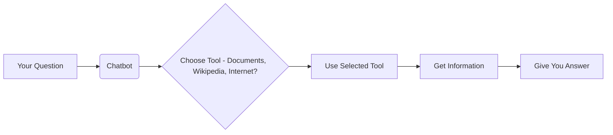
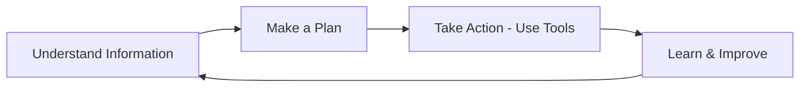
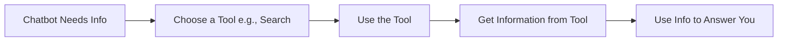
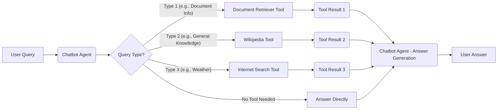

# Agentic AI Chatbot Demo: A Smart Assistant That Uses Tools

**Tagline:** See a chatbot that thinks and uses tools to help you find answers! (Code included)

This project demonstrates an AI chatbot that goes beyond simple question answering. It acts like a smart assistant by using different "tools" to find the best information for your questions.

**TRY THE CHATBOT LIVE DEMO HERE**

## What This Chatbot Can Do

- **Understands Your Questions:** The chatbot analyzes what you're asking.
- **Chooses the Right Tool:** It intelligently selects from different tools to find the answer. These tools include:
  - **Your Documents:** If you upload documents, it can search within them.
  - **Wikipedia:** For general knowledge and facts.
  - **Internet Search:** For up-to-date information on the web.
- **Gives You Relevant Answers:** It combines information from ALL these tools to provide helpful and accurate responses.
- **Remembers the Conversation:** It keeps track of your conversation, so you don't have to repeat yourself.

## How It Works - Like a Smart Detective

Imagine you ask the chatbot a question. Here's what happens behind the scenes:

1.  **You Ask:** You type your question into the chat.
2.  **The Chatbot Thinks:** It analyzes your question to figure out what kind of information it needs.
3.  **Tool Selection:** Based on your question, it chooses the best tool to use:
    - **Example:** If you ask "What's the weather in Berlin?", it will use the **Internet Search Tool** to get current weather information.
    - **Example:** If you ask "Explain model collapse?", it might first use the **Document Tool** to check any documents you've provided. If not found, it might use the **Wikipedia Tool** for a general explanation.
    - **Example:** If you ask "Who would win, Laptop Man or Superman?", it could use both the **Wikipedia Tool** and **Internet Search Tool** to find information about each character.
4.  **Tool in Action:** The chosen tool searches for the information.
5.  **Getting the Answer:** The chatbot takes the information from the tool and crafts a clear answer for you.

## Agent Actions: Beyond Just Answering Questions

This chatbot also demonstrates a key feature of "Agentic AI": **taking actions**. While it answers your questions, it can also perform simple tasks.

**Example Action: Reporting to GitHub**

To show this "action" capability, the chatbot does something a real assistant might do: it can create a report on GitHub. You can see some of the questions and answers that the chatbot has answered here - `link to github repo issues tab`

**Think of it this way:** Creating a GitHub issue is a simplified example of how an AI assistant could perform other actions for you, like:

- Sending an email.
- Updating a document.
- Booking a flight (in a more complex system).

It's about the AI being able to _do_ things, not just talk.

## What is "Agentic AI"?

"Agentic AI" is about making AI more like a helpful assistant that can think and act for itself, not just follow simple commands.

Key ideas of Agentic AI:

- **Understanding:** The AI can understand information from its surroundings (like text, web pages, etc.).
- **Planning:** It can make plans to achieve a goal, like answering your question or performing a task.
- **Acting:** It can take actions on its own using "tools" to get things done.
- **Learning:** It can learn and improve over time.

Instead of just reacting to your every instruction, an Agentic AI can take initiative to help you in a more proactive and intelligent way.

## What is "Tool Calling"?

To be truly helpful, a smart assistant needs the right tools.

"Tool Calling" is giving the AI chatbot access to resources it can use to find information or perform actions.

Think of it like giving a student access to:

- **Books and Documents:** To find specific information in texts.
- **Wikipedia:** To look up general knowledge.
- **Internet Search:** To find the latest information online.

"Tool Calling" means the AI can:

1.  **Realize it needs help:** It understands when it needs to look something up.
2.  **Choose the best tool:** It picks the right tool for the job (like searching the internet for weather).
3.  **Use the tool:** It uses the tool to get the information it needs.
4.  **Give you a better answer:** It uses the tool's results to answer your question more accurately and thoroughly.

It's how we make AI more resourceful and capable of going beyond its built-in knowledge.

## How this Chatbot implements Agentic AI and Tool Calling

The code in this repository is used to build a simple chatbot to demonstrate how Agentic AI & Tool Calling works.

**Try the Chatbot Live Demo Here**

**How does the Agentic chatbot work?**

- **It Chooses Tools:** When you ask a question, the chatbot decides if it needs to use special tools to find the answer. It doesn't just guess!
- **It Acts on its Own:** It can automatically use these tools:
  - **Document Tool:** To read stories or documents you give it.
  - **Wikipedia Tool:** To check Wikipedia for facts.
  - **Internet Tool:** To search the web for up-to-date info.
- **It Has a Goal:** The chatbot tries its best to answer your questions using all the resources it has.

**How it shows Tool Calling:**

- **It Has "Tools":** The code gives the chatbot three tools: a Document Tool, a Wikipedia Tool, and an Internet Tool.
- **It Uses Tools Smartly:** The chatbot figures out which tool (or tools) will be most helpful to answer your question.

## Tech Stack

- **[LangChain](https://langchain.com/)**: Framework for building language model applications.
- **[FAISS](https://github.com/facebookresearch/faiss)**: For efficient vector search and document retrieval.
- **[HuggingFace Embeddings](https://huggingface.co/sentence-transformers)**: Semantic similarity for knowledge retrieval.
- **[Streamlit](https://streamlit.io)**: Interactive frontend for user-friendly interactions.

## LangChain Tools Used

1. **[RAG Tool](https://python.langchain.com/docs/tutorials/rag/)**: Retrieves information from a pre-defined knowledge base.
2. **[Search Tool](https://python.langchain.com/docs/integrations/tools/tavily_search/)**: Fetches results from the web.
3. **[Wikipedia Tool](https://python.langchain.com/docs/integrations/tools/wikipedia/)**: Pulls data from Wikipedia.
